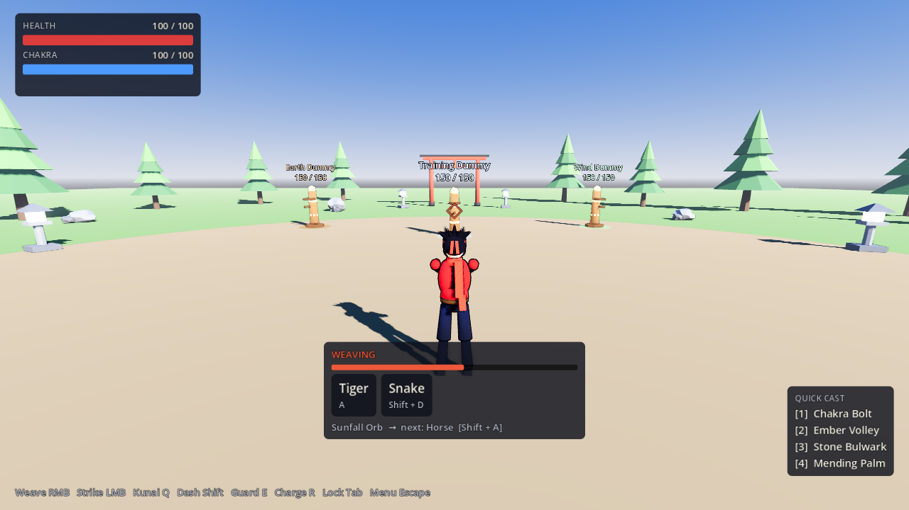
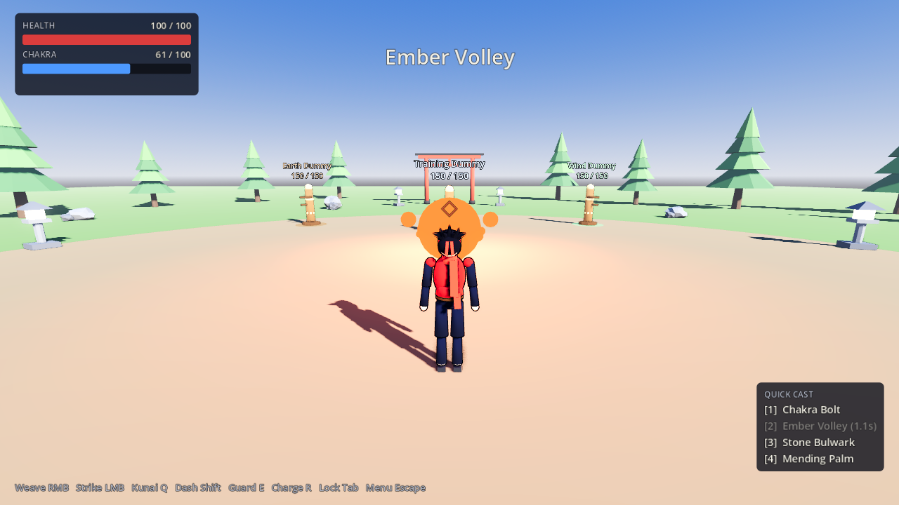

# Project Shinobi

A third-person shinobi action game built around **weaving hand seals to cast
jutsu**. It is fully playable on **keyboard + mouse and controller**, and all
controls can be remapped.

> **Scope and IP, honestly:** this is an *original* shinobi setting inspired
> by the genre, not a Naruto game. Naruto's names, characters and techniques
> are licensed IP, and fan games using them get taken down. It targets
> polished indie/AA quality, not "AAA" (a budget no small team has). See
> [docs/DESIGN.md](docs/DESIGN.md) for the reasoning.





## What you can do right now (M1: training ground)

- Run, sprint, **dash** with i-frames, **chakra double-jump**, 3-hit
  **strikes**, **kunai**, **guard**, and **charge chakra**.
- **Lock on** to targets. The camera frames the fight, and jutsu home in on
  the target.
- **Weave seals** (12 seals, 3 banks × 4 directions) and cast any of **16
  original jutsu** in 5 forms: projectile, area, wall, buff and heal. Walls
  really block projectiles, and a big hit interrupts your weave.
- **Quick-cast slots** (1–4 / D-pad) auto-weave a jutsu for you. You can
  assign any jutsu from the Jutsu Scroll in the pause menu.
- Three **training dummies** (Neutral, Earth, Wind) show **WEAK!/RESIST**
  damage numbers, so you learn the element cycle by playing.
- **Pause menu:** rebind every action on both devices, accessibility
  options (hold/toggle weaving, seal timing window or no limit, seal hints,
  sensitivities, invert Y, deadzone, vibration, screen shake, UI scale), and
  the Jutsu Scroll.

Docs:
- [docs/CONTROLS.md](docs/CONTROLS.md): full control scheme, seal chart, accessibility
- [docs/CHARACTERS.md](docs/CHARACTERS.md): making your character in VRoid Studio
- [docs/DESIGN.md](docs/DESIGN.md): scope, IP, systems, roadmap
- [CREDITS.md](CREDITS.md): third-party assets and licences

## Characters

The player is a **VRoid Studio** character: drop your export at
`game/assets/characters/player.vrm` and it replaces the placeholder. The step-by-step
guide is in [docs/CHARACTERS.md](docs/CHARACTERS.md). The game fixes facing and scale,
keeps the anime shader and hair/cloth physics, and poses the character
with IK (including the hand-seal pose) on any humanoid rig.

## Known gaps (honest list)

- **Placeholder character.** Godette (CC-BY) stands in until you add your
  own VRoid export.
- **Environment art is blockout.** Props are generated by a Blender script.
  The plan is to replace them with Poly Haven (CC0) and bought kits.
- **Procedural animation only, for now.** Poses are IK-driven, not
  motion-captured. Mixamo clip support is next.
- **No audio yet. No enemy AI yet.** The dummies don't fight back (M3).
- Tested with simulated input and in rendered screenshots, but **not yet
  play-tested on physical controllers**. Button-label detection for
  PlayStation and Nintendo pads is name-based and needs checking on real
  hardware.

## Requirements
- [Godot 4.7](https://godotengine.org/download) (standard build, not .NET)
- Optional, to regenerate models: Blender 4.5 LTS, or `pip install -r art/blender/requirements.txt` on Python 3.11

## Running

```sh
make run          # play (or: godot --path game)
make editor       # open in the Godot editor
make test         # headless test suite
make assets       # regenerate models with Blender, then re-import
make screenshots  # render demo screenshots (needs Xvfb without a display)
```

Without `make`, run the underlying commands from the [Makefile](Makefile)
directly. CI (GitHub Actions) runs the tests, rebuilds every model, and
uploads screenshots as an artifact.

## Layout

```
game/                  Godot project
  addons/              godot-vrm importer + MToon anime shader (MIT)
  assets/characters/   player.vrm (yours) / default placeholder
  autoload/            Settings, InputDevice, JutsuRegistry singletons
  data/jutsu/          Jutsu definitions (JSON, one file per element)
  scenes/              Training ground, player, dummy
  scripts/input/       Bindings table + binding (de)serialisation
  scripts/jutsu/       Seals, elements, weaver, definitions, caster, effects
  scripts/character/   VRM loading, rig-agnostic IK poser
  scripts/player/      Controller, camera
  scripts/combat/      Stats, hit helpers
  scripts/ui/          HUD, pause menu, UI kit
  scripts/world/       Training ground, dummy, toon materials
  tests/               Headless test runner + unit/integration tests
  assets/models/       Generated environment .glb blockouts
art/blender/           Scripted Blender asset pipeline
docs/                  Design, controls, images
```
