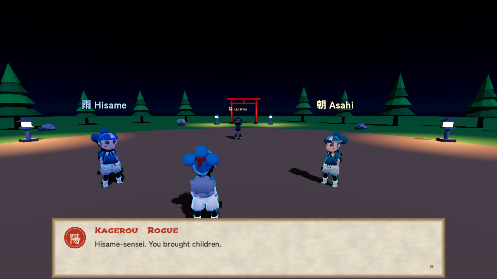
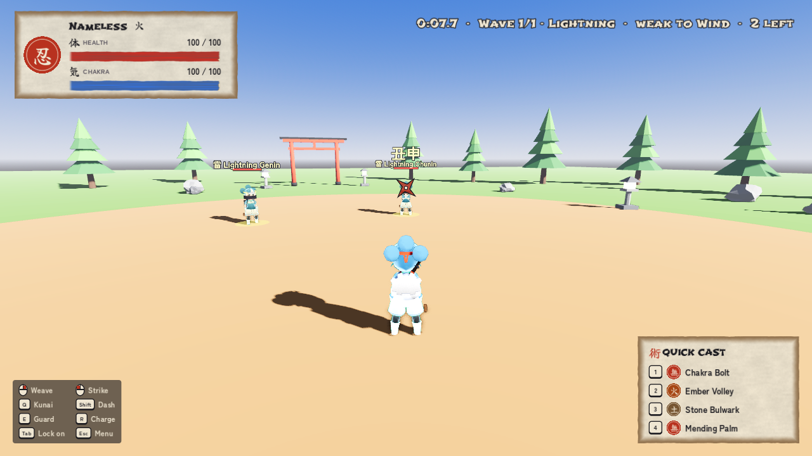
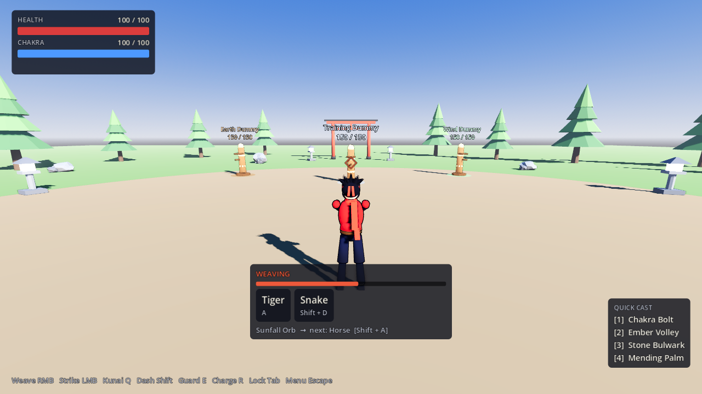
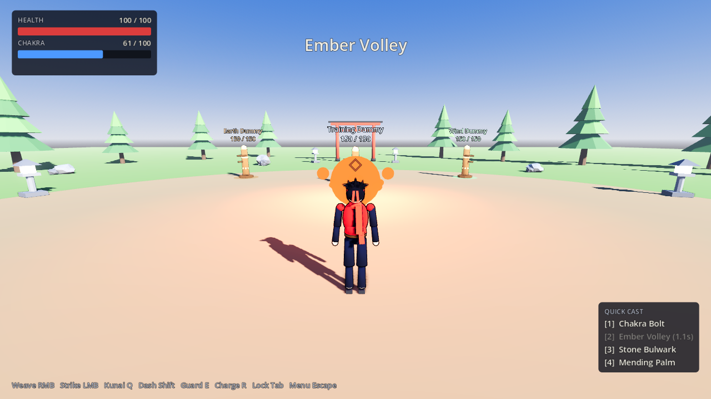
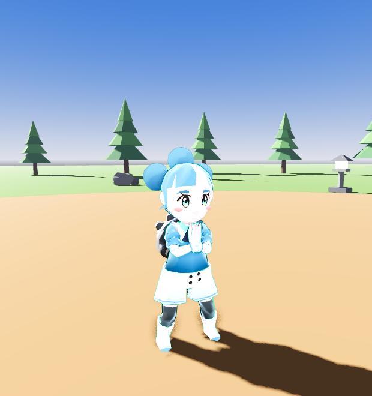
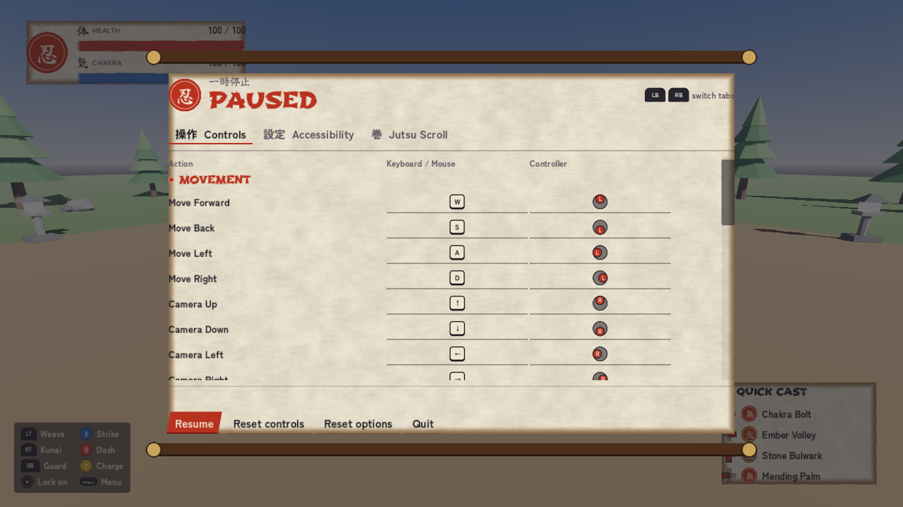
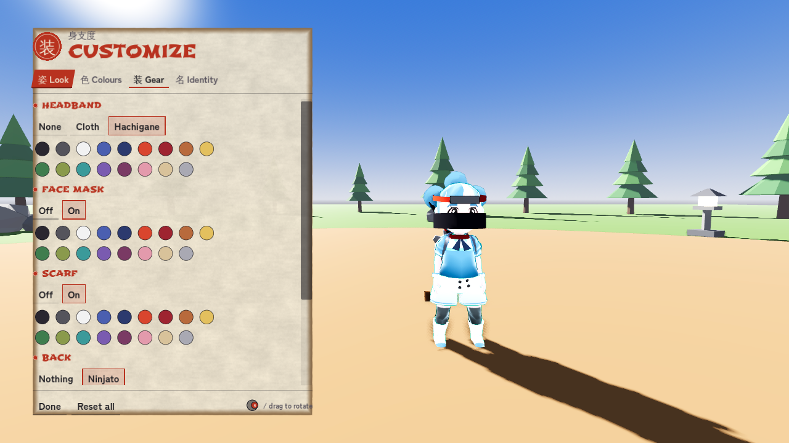

# Project Shinobi

A third-person shinobi action game built around **weaving hand seals to cast
jutsu**. It is fully playable on **keyboard + mouse and controller**, and all
controls can be remapped.

> **Scope and IP, honestly:** this is an *original* shinobi setting inspired
> by the genre, not a Naruto game. Naruto's names, characters and techniques
> are licensed IP, and fan games using them get taken down. It targets
> polished indie/AA quality, not "AAA" (a budget no small team has). See
> [docs/DESIGN.md](docs/DESIGN.md) for the reasoning.









| Hand-seal pose (IK, works on any VRoid rig) | Pause menu (controller mode) |
|---|---|
|  |  |



## What you can do right now

- **Story mode: two parts, ten chapters.** *Part One: The Stolen Scroll*
  (tutorial, rival duel, clone ambushes, a boss who changes nature as it
  weakens) and *Part Two: The Last Seal* (interrupt training, a hunter's
  duel, fighting beside allies, a survival stand in a storm, and a
  possessed giant sealed with a five-seal technique). Chapters have their
  own time of day and weather (rain, storm, snow, falling leaves). Chapters are plain data files. See
  [docs/STORY.md](docs/STORY.md) to write your own.
- **Cutscenes:** the chapters open and close with short in-engine films: a
  dawn drop from the torii, lightning-borne rivals, a leap into a standoff,
  a possession by five natures, a storm clearing to dawn. Camera shots,
  walks and leaps, flashes of chakra, all data-driven (see
  [docs/STORY.md](docs/STORY.md)). Hold Pause to skip.
- **Trial of the Five Natures** (from the title screen): five waves of
  enemy shinobi (chakra clones), one nature per wave: Fire, Wind, Lightning,
  Earth, then Water with a jonin. Each wave's weakness is shown. Enemies
  strafe, throw kunai, strike in combos, dodge your projectiles, guard, and
  **weave jutsu with their seals shown above their heads**. Hit them hard
  enough mid-weave to interrupt (a kunai stops a genin, not a chunin). Your
  best time is saved.
- **Training Ground:** the same arena with dummies that don't hit back.

- Run, sprint, **dash** with i-frames, **chakra double-jump**, 3-hit
  **strikes**, **kunai** (soft-aimed, they stick where they land), **guard**, and **charge chakra**.
- **Motion-captured animation** on every character: walk, jog and sprint
  played at the speed the character is really moving (measured stride, so
  feet don't skate), jumps and landings, jab-cross punches, a palms-out
  release when a jutsu fires, flinches when hit, a fall when defeated, and
  gestures while a story character speaks. The procedural rig layers hand
  seals, guard, charge and the arms-back shinobi sprint on top.
- **Lock on** to targets. The camera frames the fight, and jutsu home in on
  the target.
- **Weave seals** (12 seals, 3 banks × 4 directions) and cast any of **18
  original jutsu** in 6 forms: projectile, area, wall, buff, heal and
  summon. Walls really block projectiles, and a big hit interrupts your weave.
- **Ultimates:** fighting fills a gold meter (landing blows, taking them,
  interrupting weaves, perfect guards). Full, press **V / B** and time
  stops: a close-up of your seals under a brush title card, then a wide shot
  of the blow. One original ultimate per nature (a falling sun, a cyclone
  that lifts foes, chain lightning, a stone fist, a breaking wave) plus
  Hundred Shades, a storm of shade clones any nature can learn. Choose yours
  in the Jutsu tab. Hold Pause to skip the cinematic.
- **Shade Clones** (a summon): two chakra doubles step out of your shadow,
  wearing your own look, and fight at your side for 14 seconds. They are
  fragile, cost a lot of chakra, and casting again replaces them.
- **Eight quick-cast slots** (1–8, or the D-pad with Back flipping between
  slots 1–4 and 5–8) cast a jutsu for you. Each slot is either **Weave**
  (the seals are formed for you) or **Instant** (no seals at all, for 35%
  more chakra).
- **Jutsu loadouts:** up to eight named presets of those slots, edited in
  Pause → Jutsu Scroll (or while creating your character), saved with your
  character and swapped in battle with Z / X. Three starters are included:
  Balanced, Assault and Guardian.
- Three **training dummies** (Neutral, Earth, Wind) show **WEAK!/RESIST**
  damage numbers, so you learn the element cycle by playing.
- **Ink-and-scroll UI:** washi-paper panels, brush-stroke health/chakra
  bars, talisman seals with zodiac kanji, a burning-fuse timing window, a
  shuriken lock-on marker, and drawn keyboard/mouse/Xbox/PlayStation/Nintendo
  button icons that switch the moment you change device.
- **Save slots:** ten. The title screen has Continue (the slot you played
  last, at the first chapter you haven't cleared), New Game and Load / Delete
  Save (cards showing name, clan, chapters cleared and play time; a Delete
  button on every save, or Delete / X on the selected one) and
  asks before overwriting anything. Each slot holds its own shinobi, jutsu
  loadouts, story progress and records, and saves as you play. A save from
  an older version becomes slot 1.
- **Character creation** (New Game): pick a **clan**, an **eye art**, your
  name and nature, your look and gear, and your jutsu loadout, then begin
  chapter one. All of it can be changed later from Pause → Customize.
- **Clans** (original to this game): Hearth (fire), Gale (wind), Stormvein
  (lightning), Stonewright (earth), Tidebound (water) and the clanless
  Wayfarer. A clan fixes your chakra nature (a Wayfarer chooses) and brings
  perks such as extra health, faster chakra recovery, a shorter dash
  cooldown or more damage in its nature.
- **Eye arts** (original, not anyone's dojutsu): **Hawk Eye** (longer
  lock-on, homing jutsu, shows who is weak to you), **Mirror Eye** (a dash
  through a hit slows time and refunds chakra), **Seal Eye** (rivals weave
  slower, your own seals fly faster) and **Still Eye** (a guard raised at the
  last instant blocks a blow completely). Each clan can awaken only some of
  them, and your eyes change colour with the one you pick.
- **Opening your eye art in battle** (hold LB, press Y / Ctrl + R): for
  25 chakra your eye art opens for 12 seconds, drawing its own animated
  pattern in your irises (a slit pupil and feather marks, two facing
  crescents, a ring of twelve seal marks or a lotus) and strengthening its
  perks. The first time in each area plays a close-up cinematic; after that
  it just flashes. Clearing Part One **awakens** it: a second pattern
  (Sky Roc Eye, Twin Mirror Eye, Star Seal Eye, Lotus Eye), stronger perks
  and its own awakening cinematic. All four patterns are original.
- **The ultimate meter keeps its charge** from one fight to the next.
- **Character customization** (Pause → Customize): pick from your
  VRoid roster, tint hair/eyes/skin/outfit, add ninja gear fitted to the
  character's measured head and body (headband or hachigane, mask, scarf,
  ninjato, kunai pouch), set height and expression, name your shinobi, and
  choose a chakra nature (its jutsu cost 20% less chakra).
- **Ray tracing** (on GPUs that have it: NVIDIA RTX, AMD RX 6000+, Intel
  Arc): real hardware ray tracing through Vulkan. The sea mirrors the
  island, shiny steel reflects its surroundings, and ray-traced ambient
  occlusion gives contact shadows under characters and props. Toggle it in
  Pause → Accessibility → Display. On other GPUs the option is greyed out
  and the game looks exactly as before.
- **Photographed skies and scanned ground** (Poly Haven, CC0): every time
  of day and weather is a real sky photograph, with the sun turned to
  match the sun in the photo and the ambient light, reflections and fog
  taken from it. The ground layers are photo-scanned surfaces at their
  real size, blending by height (dirt settles into the hollows between
  grass).
- **Graphics settings** (Pause → Graphics): Low / Medium / High / Ultra
  presets, window mode, VSync, frame rate cap, render resolution with FSR,
  anti-aliasing (FXAA, MSAA, TAA), shadow quality, ambient occlusion,
  bloom, brightness, field of view, ray tracing and the lighting tier
  (High adds real-time global illumination and volumetric fog, Ultra adds
  depth of field in cinematics and film grain).
- **Pause menu:** rebind every action on both devices, accessibility
  options (hold/toggle weaving, seal timing window or no limit, seal hints,
  sensitivities, invert Y, deadzone, vibration, screen shake, UI scale), and
  the Jutsu Scroll.

Docs:
- [docs/CONTROLS.md](docs/CONTROLS.md): full control scheme, seal chart, accessibility
- [docs/CHARACTERS.md](docs/CHARACTERS.md): making your character in VRoid Studio
- [docs/STORY.md](docs/STORY.md): the story chapters and how to write new ones
- [docs/DESIGN.md](docs/DESIGN.md): scope, IP, systems, roadmap
- [CREDITS.md](CREDITS.md): third-party assets and licences

## Characters

The player is a **VRoid Studio** character: drop your export at
`game/assets/characters/player.vrm` and it replaces the placeholder. The step-by-step
guide is in [docs/CHARACTERS.md](docs/CHARACTERS.md). The game fixes facing and scale,
keeps the anime shader and hair/cloth physics, and poses the character
with IK (including the hand-seal pose) on any humanoid rig.

## Known gaps (honest list)

- **Characters are VRoid Studio samples.** Nine CC0 models with swappable
  hair and outfits. Their clothes are everyday outfits (a hoodie, uniforms,
  dresses) dyed dark, not ninja gear. Real ninja costumes need to be made in
  VRoid Studio or bought.
- **Environment props are scripted, not hand-sculpted.** Every prop
  (torii, lanterns, shrine, houses, trees, rocks) is built by Blender
  scripts (`art/blender/build_assets.py`, `textures.py`). The skies and
  ground are real photographs and scans now, but the props, the cone-shaped
  pines and the anime characters are still stylised next to them.
- **Ray tracing is untested on real ray tracing hardware.** It was built
  and checked on a software Vulkan driver (Mesa lavapipe), which runs the
  same ray tracing API but tells nothing about speed. Expect it to cost a
  few milliseconds a frame on an RTX 3060-class card; turn it off if the
  frame rate drops. It needs the Vulkan renderer (the default on Windows).
- **The motion capture is a free library, not a custom shoot.** Thirteen
  clips from Quaternius' Universal Animation Library (CC0) drive walking,
  jogging, sprinting, jumping, two punches (boxing-style, not martial arts),
  a spell cast, flinches, a fall and a talking idle, retargeted onto every
  character. Hand seals, guard, chakra charge, the dash and the kunai throw
  are still procedural IK, and there are no kicks or sword strikes. Mixamo
  clips you download can replace any of them (see
  [docs/CHARACTERS.md](docs/CHARACTERS.md)).
- **Sound effects are synthesised.** Every sound is generated by
  `art/audio/make_sfx.py` (original, no licensing). They're game-jam quality,
  not studio foley. Drop recorded sounds with the same file names into
  `game/assets/audio/sfx/` to replace any of them.
- **The music is sequenced, not performed.** Four original tracks (title,
  calm, battle, boss) are written note by note in `art/audio/make_music.py`
  and rendered with a General MIDI soundfont's koto, shakuhachi, shamisen,
  taiko, strings and choir. That sounds like good MIDI, not a recorded
  orchestra. Replace any `game/assets/audio/music/*.ogg` with a real
  recording of the same name.
- **Voices are text-to-speech.** Every story character is voiced with the
  Kokoro neural model (`art/audio/make_voices.py`: a cast voice per
  character, names spelled out phonetically, paced by mood, nothing
  pitch-shifted). It sounds like a person reading, much less robotic than
  the earlier Piper voices, but it's still reading, not acting: no real
  shouting, crying or laughing. Your own character is silent on purpose
  (you choose the name and look).
- **Conversations are lightly animated:** the speaker gestures (a talking
  idle), the face holds an expression and the mouth opens with the voice,
  but there's no lip sync.
- **Enemies are simple.** The AI is a hand-written state machine (range
  keeping, strafing, kunai, melee combos, dodge and guard rolls, weaving),
  not a learning or tactical AI. Enemies use the same placeholder model as
  you unless you add VRoid characters to the roster, and they don't use walls
  or heal yet.
- Tested with simulated input and in rendered screenshots, but **not yet
  play-tested on physical controllers**. Button-label detection for
  PlayStation and Nintendo pads is name-based and needs checking on real
  hardware.

## Just want to play? (Windows)

Every push builds a Windows exe. On GitHub: **Actions** tab → the latest
green **CI** run → **Artifacts** → **ProjectShinobi-Windows**. Unzip it and
run `ProjectShinobi.exe`. You need to be signed in to GitHub to download
artifacts.

## Requirements
- [Godot 4.7](https://godotengine.org/download) (standard build, not .NET)
- Optional, to regenerate models: Blender 4.5 LTS, or `pip install -r art/blender/requirements.txt` on Python 3.11

## Running

```sh
make run          # play (or: godot --path game)
make editor       # open in the Godot editor
make test         # headless test suite
make assets       # regenerate models with Blender, then re-import
make animations   # set up the clip library (and any Mixamo clips you added) for retargeting
make sfx          # regenerate the sound effects (needs numpy + scipy)
make music        # re-render the music (needs mido, fluidsynth, fluid-soundfont-gm, vorbis-tools)
make voices KOKORO=path/to/kokoro-model-folder  # re-record story lines
make fonts        # re-subset the Japanese UI fonts after adding kanji (needs fonttools)
make screenshots  # render demo screenshots (needs Xvfb without a display)
```

Without `make`, run the underlying commands from the [Makefile](Makefile)
directly. CI (GitHub Actions) runs the tests, rebuilds every model, and
uploads screenshots as an artifact.

## Layout

```
game/                  Godot project
  addons/              godot-vrm importer + MToon anime shader (MIT)
  assets/characters/   player.vrm (yours) / default placeholder
  autoload/            Settings, InputDevice, JutsuRegistry, Profile singletons
  data/jutsu/          Jutsu definitions (JSON, one file per element)
  scenes/              Training ground, player, dummy
  scripts/input/       Bindings table + binding (de)serialisation
  scripts/jutsu/       Seals, elements, weaver, definitions, caster, effects
  scripts/character/   VRM loading, IK poser, clip animator, styler, gear
  scripts/player/      Controller, camera
  scripts/combat/      Stats, hit helpers
  scripts/ui/          HUD, pause menu, UI kit
  scripts/world/       Training ground, islands, terrain, ray tracing (rt/), toon materials
  tools/               Headless tools (clip retarget setup, stride measuring)
  tests/               Headless test runner + unit/integration tests + fixtures
  assets/models/       Props and gear modelled by art/blender/build_assets.py (.gltf)
  assets/textures/     Tileable materials baked by art/blender/textures.py
  assets/textures/ground/  Scanned ground (Poly Haven) packed by art/polyhaven/fetch.py
  assets/skies/        Sky photographs (Poly Haven HDRIs) packed by art/polyhaven/fetch.py
art/blender/           Scripted Blender asset pipeline
art/polyhaven/         Downloads and packs the Poly Haven skies and ground (make polyhaven)
docs/                  Design, controls, images
```
