# Project Shinobi

<p align="center">
  <a href="https://cdn.jsdelivr.net/gh/mhdiraza2708/projectshinobi@74a9ee0b1de8ca4807d849cbf60e81c6fb06189d/docs/media/shinobi_teaser.mp4">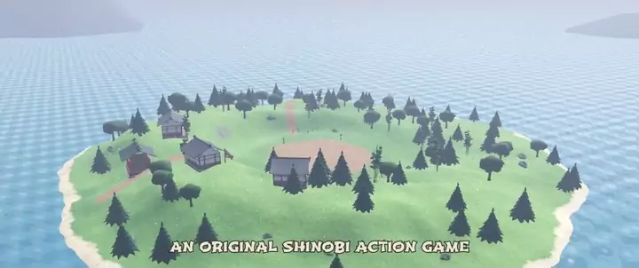</a>
  <br>
  <b><a href="https://cdn.jsdelivr.net/gh/mhdiraza2708/projectshinobi@74a9ee0b1de8ca4807d849cbf60e81c6fb06189d/docs/media/shinobi_teaser.mp4">▶ Watch the 50-second teaser (with sound)</a></b>
  · <a href="docs/media/shinobi_teaser.mp4">download</a>
  <br>
  <sub>Recorded in-engine. It predates the open world and the skill trees.</sub>
</p>

A third-person shinobi action game built around **weaving hand seals to cast
jutsu**. It is fully playable on **keyboard + mouse and controller**, and all
controls can be remapped.

> **Scope and IP, honestly:** this is an *original* shinobi setting inspired
> by the genre, not a Naruto game. Naruto's names, characters and techniques
> are licensed IP, and fan games using them get taken down. It targets
> polished indie/AA quality, not "AAA" (a budget no small team has). See
> [docs/DESIGN.md](docs/DESIGN.md) for the reasoning.

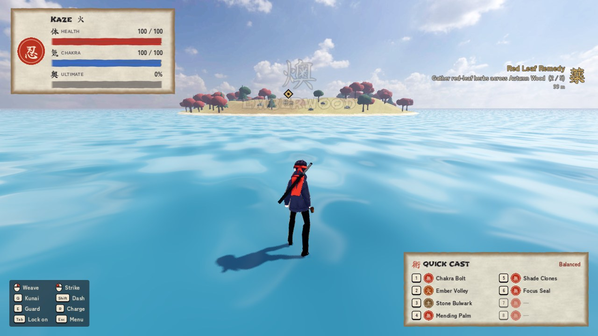

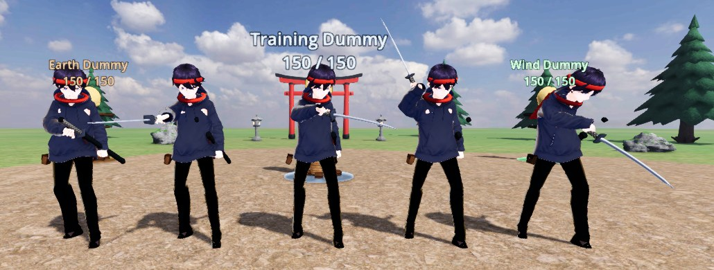

| | |
|---|---|
| 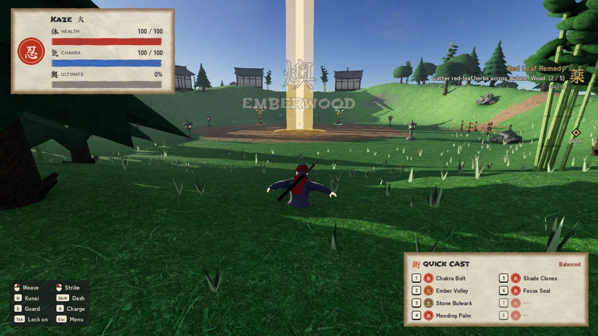 | 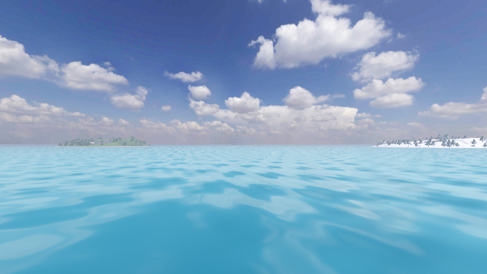 |
| 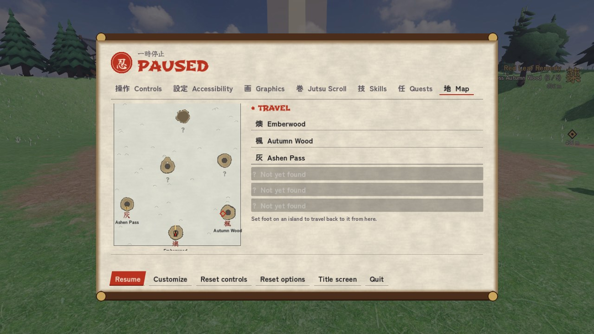 | 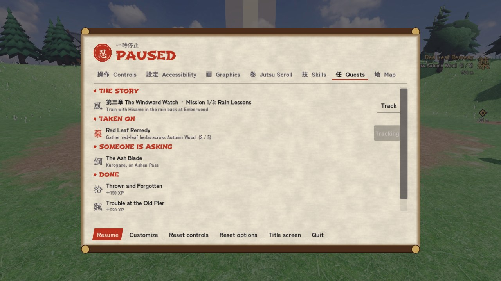 |
| 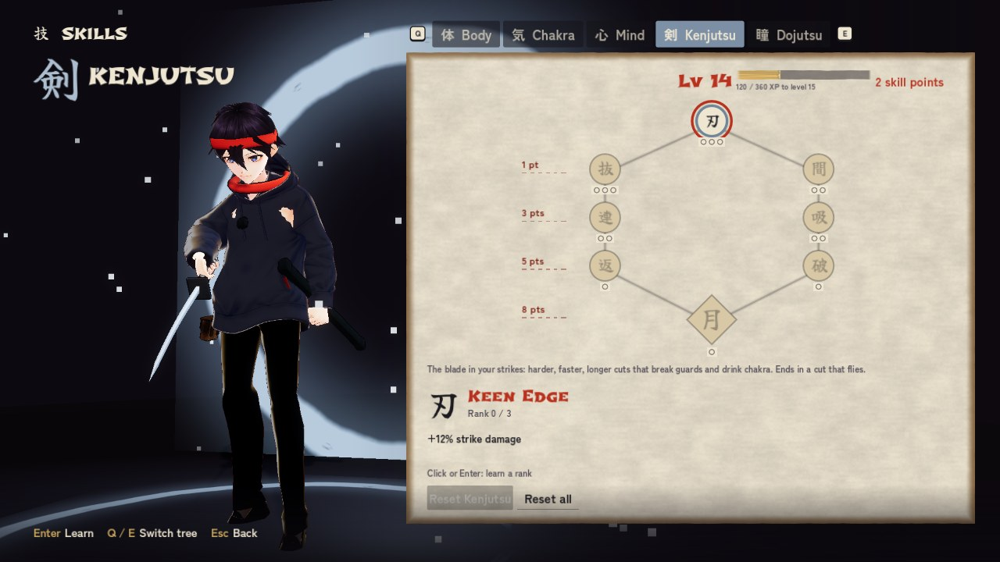 | 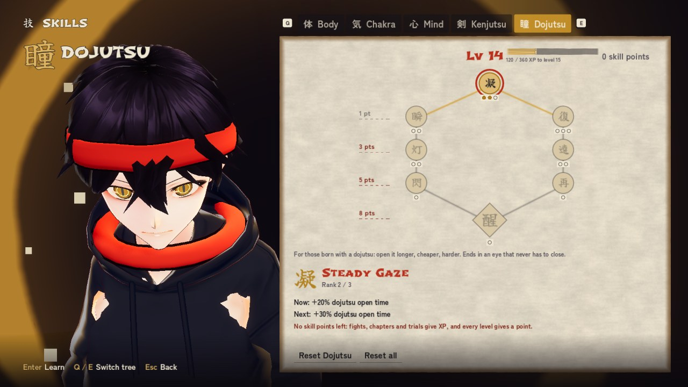 |

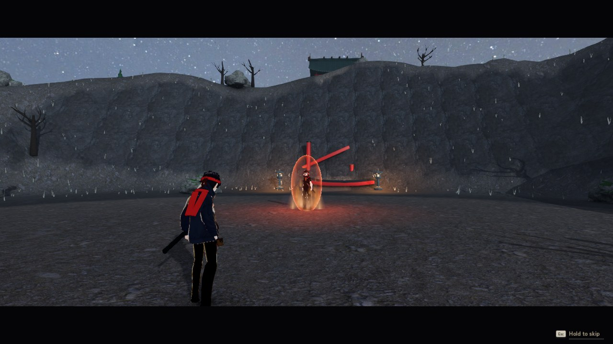

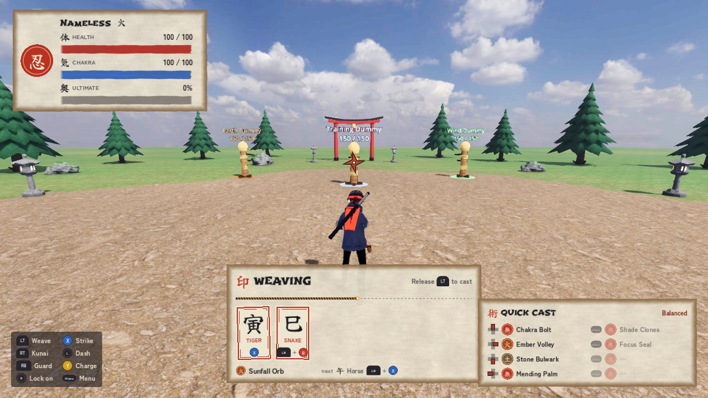

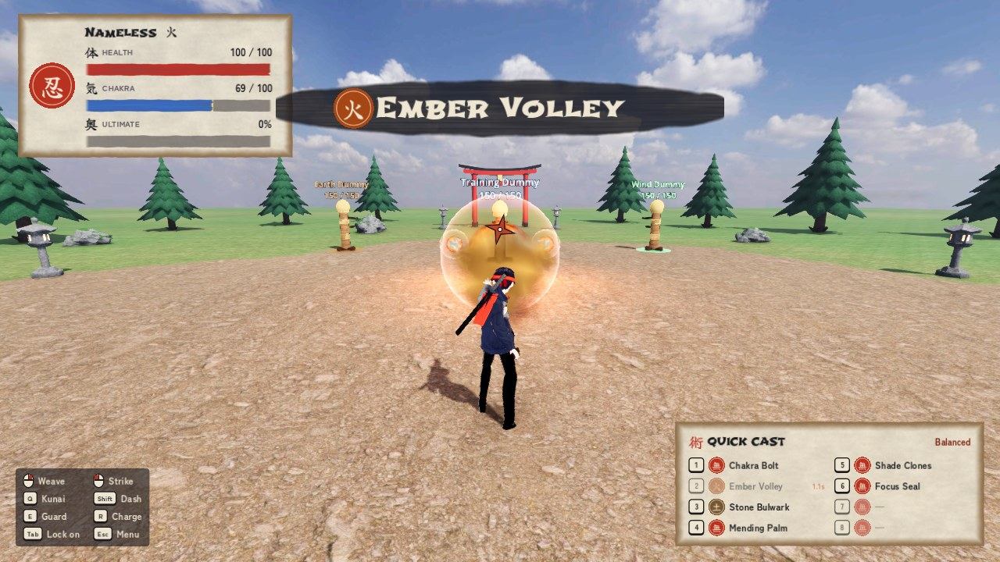

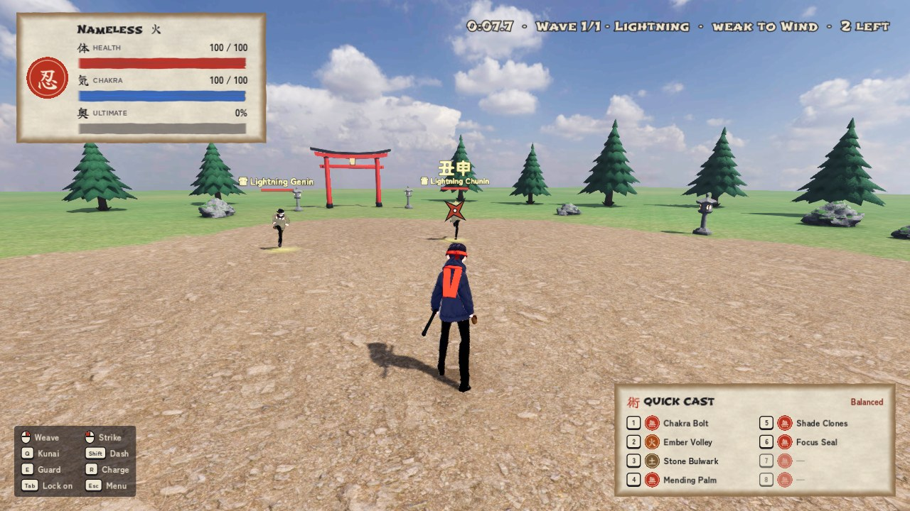

## What you can do right now

- **An open world of islands.** Continue a save (or start one) and you're
  on Emberwood with the whole archipelago around you: six islands in one
  sea, and shinobi run on water, so you cross on foot (hold Sprint on open
  water to run faster). Each island announces itself as you arrive; Five
  Winds is a summit you reach from leap stones at the foot of its cliffs.
  The story waits at a **pillar of light** where the next chapter happens;
  step in and press **Interact (T, or X beside someone)** to play it right
  there. People around the islands ask for help: **eight original side
  quests** (gather, drive off bandits, a duel, a delivery across the sea,
  and a post-game trial), opened as the story goes on, tracked on screen
  with a marker and listed in **Pause → Quests**, and paid in XP. The day
  turns while you roam (a 24-minute day: dawn, day, dusk and night, the
  photographed skies crossfading and every island's lanterns lit at night),
  **Pause → Map** charts the islands with you, the story's pillar and
  quest-givers on it, and any island you've set foot on can be travelled
  back to from there. Your place and the time of day are saved with the
  slot. (Chapters can still be replayed on their own from the title's
  chapter list.)
- **Story: six chapters, eighteen missions, across the islands.** A new
  genin, a loud rival, a stolen scroll and the five-beast spirit sealed in
  it: *The Graduation*, *The Ashen Trail*, *The Windward Watch*, *The Old
  Dam*, *Kagerou's Reason* and *Nue*. Missions happen where the story does
  (the academy yard, a burned pass, a forest shrine, a dam, a snowbound road,
  a summit), so you cross the sea between them; arriving starts the mission
  with a banner, and when it ends the next objective is on your tracker. Boss
  duels, a boss who changes nature as it weakens, fights beside allies, a
  survival stand in a storm, and a finale sealed with a five-seal technique.
  Every line is voiced (Kokoro TTS). Missions are plain data files. See
  [docs/STORY.md](docs/STORY.md) to write your own.
- **Cutscenes:** the chapters open and close with short in-engine films: a
  dawn drop from the torii, lightning-borne rivals, a leap into a standoff,
  a possession by five natures, a storm clearing to dawn. Camera shots,
  walks and leaps, flashes of chakra, all data-driven (see
  [docs/STORY.md](docs/STORY.md)). Hold Pause to skip.
- **Trial of the Five Natures** (from the title screen): five waves of
  enemy shinobi (chakra clones), one nature per wave: Fire, Wind, Lightning,
  Earth, then Water with a jonin. Each wave's weakness is shown. Enemies
  strafe, throw kunai, strike in combos, dodge your projectiles, guard, and
  **weave jutsu with their seals shown above their heads**. Hit them hard
  enough mid-weave to interrupt (a kunai stops a genin, not a chunin). Your
  best time is saved.
- **Training Ground:** the same arena with dummies that don't hit back.

- Run, sprint, **dash** with i-frames, **chakra double-jump**, **kunai**
  (soft-aimed, they stick where they land), **guard**, and **charge chakra**.
- **Swordwork:** your ninjato is worn at the left hip. The first strike
  draws it in a level cut across the front, the next cut down across from
  the shoulder, back up, and straight down from overhead as the finisher,
  standing or on the run (the blade trails behind you in the shinobi run).
  A few quiet seconds and it goes home to the scabbard; weaving seals puts
  it away at once (you need both hands). The Kenjutsu tree sharpens all of
  it. Jonin and anyone else wearing a sword fight the same way. The blade leaves a
  ribbon of light in the draw and every cut, a glint runs up it as it comes
  out, and a landed cut holds the world for a heartbeat and throws sparks
  along its line.
- **Motion-captured animation** on every character: walk, jog and sprint
  played at the speed the character is really moving (measured stride, so
  feet don't skate), jumps and landings, jab-cross punches (unarmed), a palms-out
  release when a jutsu fires, flinches when hit, a fall when defeated, and
  gestures while a story character speaks. The procedural rig layers hand
  seals, guard, charge, the sword's draw, cuts and sheathing, and the
  arms-back shinobi sprint on top.
- **Lock on** to targets. The camera frames the fight, and jutsu home in on
  the target.
- **Weave seals** (12 seals, 3 banks × 4 directions) and cast any of **18
  original jutsu** in 6 forms: projectile, area, wall, buff, heal and
  summon. Walls really block projectiles, and a big hit interrupts your weave.
- **Ultimates:** fighting fills a gold meter (landing blows, taking them,
  interrupting weaves, perfect guards). Full, press **V / B** and time
  stops: a close-up of your seals under a brush title card, then a wide shot
  of the blow. One original ultimate per nature (a falling sun, a cyclone
  that lifts foes, chain lightning, a stone fist, a breaking wave) plus
  Hundred Shades, a storm of shade clones any nature can learn. Choose yours
  in the Jutsu tab. Hold Pause to skip the cinematic.
- **Skill trees** (Pause → Skills → Open skill trees): a full screen with
  your own shinobi posed on a lit stage beside the tree, each tree with its
  own stance and colour (the Dojutsu tree pushes in on your face with your
  dojutsu open; Kenjutsu cuts the air). Fights, story chapters, quests and
  trials give XP, and every level (up to 80) is a skill point. Five
  original trees, each a branching path of
  ranked nodes that ends in a final skill: Way of the Body 体 (**Second
  Wind**: a blow that would defeat you leaves you standing, once a fight),
  Way of Chakra 気 (**Twin Weave**: every projectile jutsu fires an echo),
  Way of the Mind 心 (**Shadow Bloom**: Shade Clones burst when they go),
  Kenjutsu 剣 (faster, longer, harder cuts, a counter after a blocked blow,
  guard breaking; **Crescent Moon**: a combo's third cut flies on as a blade
  of chakra) and Dojutsu 瞳, for dojutsu users (**Unclosing Eye**: past its
  time the eye stays open on chakra). Deeper tiers open as you spend points in a tree,
  and points can be taken back for free. Saved per save slot.
- **Shade Clones** (a summon): two chakra doubles step out of your shadow,
  wearing your own look, and fight at your side for 14 seconds. They are
  fragile, cost a lot of chakra, and casting again replaces them.
- **Eight quick-cast slots** (1–8, or the D-pad with Back flipping between
  slots 1–4 and 5–8) cast a jutsu for you. Each slot is either **Weave**
  (the seals are formed for you) or **Instant** (no seals at all, for 35%
  more chakra).
- **Jutsu loadouts:** up to eight named presets of those slots, edited in
  Pause → Jutsu Scroll (or while creating your character), saved with your
  character and swapped in battle with Z / X. Three starters are included:
  Balanced, Assault and Guardian.
- Three **training dummies** (Neutral, Earth, Wind) show **WEAK!/RESIST**
  damage numbers, so you learn the element cycle by playing.
- **Ink-and-scroll UI:** washi-paper panels, brush-stroke health/chakra
  bars, talisman seals with zodiac kanji, a burning-fuse timing window, a
  shuriken lock-on marker, and drawn keyboard/mouse/Xbox/PlayStation/Nintendo
  button icons that switch the moment you change device.
- **Save slots:** ten. The title screen has Continue (the slot you played
  last, at the first chapter you haven't cleared), New Game and Load / Delete
  Save (cards showing name, clan, chapters cleared and play time; a Delete
  button on every save, or Delete / X on the selected one) and
  asks before overwriting anything. Each slot holds its own shinobi, jutsu
  loadouts, story progress and records, and saves as you play. A save from
  an older version becomes slot 1.
- **One main character**, the game's own: everyone plays the same
  androgynous shinobi in an indigo haori, katana at the hip.
- **Character creation** (New Game): pick a **clan**, a **dojutsu**, your
  name and nature, and your jutsu loadout, then begin chapter one. All of
  it can be changed later from Pause → Customize.
- **Clans** (original to this game): Hearth (fire), Gale (wind), Stormvein
  (lightning), Stonewright (earth), Tidebound (water) and the clanless
  Wayfarer. A clan fixes your chakra nature (a Wayfarer chooses) and brings
  perks such as extra health, faster chakra recovery, a shorter dash
  cooldown or more damage in its nature.
- **Dojutsu** (all original; no canon eyes): **Hawk Eye** (longer
  lock-on, homing jutsu, shows who is weak to you), **Mirror Eye** (a dash
  through a hit slows time and refunds chakra), **Seal Eye** (rivals weave
  slower, your own seals fly faster) and **Still Eye** (a guard raised at the
  last instant blocks a blow completely). Each clan can awaken only some of
  them, and your eyes change colour with the one you pick.
- **Opening your dojutsu in battle** (hold LB, press Y / Ctrl + R): for
  25 chakra your dojutsu opens for 12 seconds, drawing its own animated
  pattern in your irises (a slit pupil and feather marks, two facing
  crescents, a ring of twelve seal marks or a lotus) and strengthening its
  perks. The first time in each area plays a close-up cinematic; after that
  it just flashes. Clearing Part One **awakens** it: a second pattern
  (Sky Roc Eye, Twin Mirror Eye, Star Seal Eye, Lotus Eye), stronger perks
  and its own awakening cinematic. All four patterns are original.
  The awakened **Mirror Eye** also gains **Mirror Return**: while it's open,
  guarding swallows enemy jutsu (up to three) instead of blocking them, and
  LB + Y throws them all back at your target, half again as strong.
- **The ultimate meter keeps its charge** from one fight to the next.
- **Customize** (Pause → Customize): rename your shinobi, change clan,
  dojutsu and jutsu, and choose a chakra nature (its jutsu cost 20% less
  chakra).
- **Ray tracing** (on GPUs that have it: NVIDIA RTX, AMD RX 6000+, Intel
  Arc): real hardware ray tracing through Vulkan. The sea mirrors the
  island, shiny steel reflects its surroundings, and ray-traced ambient
  occlusion gives contact shadows under characters and props. Toggle it in
  Pause → Accessibility → Display. On other GPUs the option is greyed out
  and the game looks exactly as before.
- **Photographed skies and scanned ground** (Poly Haven, CC0): every time
  of day and weather is a real sky photograph, with the sun turned to
  match the sun in the photo and the ambient light, reflections and fog
  taken from it. Each hour is graded to its mood: dusk is golden hour
  (amber haze under a violet sky, a low orange sun and long shadows),
  dawn is cool pink and night a deep moonlit blue. The ground layers are
  photo-scanned surfaces at their real size, blending by height (dirt
  settles into the hollows between grass).
- **Life in the air**: embers and ash drift over the Ashen Pass, red maple
  leaves fall in Autumn Wood, light snow on the Frozen Road, fine mist by
  Old Dam's water, wind streaks across Five Winds, pollen and petals in
  Emberwood by day, and a few fireflies near the ground on every island
  at night. A light touch (a few hundred particles in all), fewer on the
  Medium preset and none on Low.
- **Life on the sea**: the water between islands has things in it now.
  Rocky islets and sea stacks stand along every route (a shrine on its
  own islet with a gate and lanterns, and a plastered watch-tower whose lamp
  burns from dusk), each solid enough to stand on, with a lane kept clear
  between every pair of islands so the run never snags. White surf rolls in
  along every coast and piles up against the rocks, and gulls wheel over each
  island and cluster (they roost at night). All of it is a handful of draw
  calls: the gulls are one instanced mesh flown entirely on the GPU.
- **Graphics settings** (Pause → Graphics): Low / Medium / High / Ultra
  presets, window mode, VSync, frame rate cap, render resolution with FSR,
  anti-aliasing (FXAA, MSAA, TAA), shadow quality, ambient occlusion,
  bloom, brightness, field of view, ray tracing and the lighting tier
  (High adds real-time global illumination and volumetric fog, Ultra adds
  depth of field in cinematics and film grain).
- **Pause menu:** rebind every action on both devices, accessibility
  options (hold/toggle weaving, seal timing window or no limit, seal hints,
  sensitivities, invert Y, deadzone, vibration, screen shake, UI scale), and
  the Jutsu Scroll.

Docs:
- [docs/CONTROLS.md](docs/CONTROLS.md): full control scheme, seal chart, accessibility
- [docs/CHARACTERS.md](docs/CHARACTERS.md): making your character in VRoid Studio
- [docs/STORY.md](docs/STORY.md): the story chapters and how to write new ones
- [docs/DESIGN.md](docs/DESIGN.md): scope, IP, systems, roadmap
- [CREDITS.md](CREDITS.md): third-party assets and licences

## Characters

The player is the game's **main character**, a Tripo model rigged with the
Mixamo skeleton (`game/assets/characters/main/mc.glb`). The story cast and
rivals are VRoid Studio characters and Tripo models. The game maps any of
these onto Godot's humanoid skeleton, fixes facing and scale, and poses
them with IK (including the hand-seal pose). The step-by-step guide is in
[docs/CHARACTERS.md](docs/CHARACTERS.md).

## Known gaps (honest list)

- **Characters are VRoid Studio samples.** Nine CC0 models with swappable
  hair and outfits. Their clothes are everyday outfits (a hoodie, uniforms,
  dresses) dyed dark, not ninja gear. Real ninja costumes need to be made in
  VRoid Studio or bought.
- **Environment props are scripted, not hand-sculpted.** Every prop
  (torii, lanterns, shrine, houses, trees, rocks) is built by Blender
  scripts (`art/blender/build_assets.py`, `textures.py`). The skies and
  ground are real photographs and scans now, but the props, the cone-shaped
  pines and the anime characters are still stylised next to them.
- **Ray tracing is untested on real ray tracing hardware.** It was built
  and checked on a software Vulkan driver (Mesa lavapipe), which runs the
  same ray tracing API but tells nothing about speed. Expect it to cost a
  few milliseconds a frame on an RTX 3060-class card; turn it off if the
  frame rate drops. It needs the Vulkan renderer (the default on Windows).
- **The motion capture is a free library, not a custom shoot.** Thirteen
  clips from Quaternius' Universal Animation Library (CC0) drive walking,
  jogging, sprinting, jumping, two punches (boxing-style, not martial arts),
  a spell cast, flinches, a fall and a talking idle, retargeted onto every
  character. Hand seals, guard, chakra charge, the dash, the kunai throw and
  all the swordwork (draw, three cuts, sheathe) are procedural IK: they read
  as sword cuts, but they're keyed by hand, not motion-captured, and the
  sword is one-handed. There are no kicks. Mixamo
  clips you download can replace any of them (see
  [docs/CHARACTERS.md](docs/CHARACTERS.md)).
- **Sound effects are synthesised.** Every sound is generated by
  `art/audio/make_sfx.py` (original, no licensing). They're game-jam quality,
  not studio foley. Drop recorded sounds with the same file names into
  `game/assets/audio/sfx/` to replace any of them.
- **The music is sequenced, not performed.** Fourteen original tracks (the
  title, a theme for each of the six islands, the sea, the night, two battle
  themes, the boss, and a tense and a sad cue for the story) are written note
  by note in `art/audio/make_music.py` and rendered with a General MIDI
  soundfont's koto, shakuhachi, shamisen, taiko, strings, choir, harp and
  bells. That sounds like good MIDI, not a recorded orchestra, and each
  track is a loop of about a minute, so a long walk repeats them. Replace any
  `game/assets/audio/music/*.ogg` with a real recording of the same name.
- **Voices are text-to-speech.** Every story character is voiced with the
  Kokoro neural model (`art/audio/make_voices.py`: a cast voice per
  character, names spelled out phonetically, paced by mood, nothing
  pitch-shifted). It sounds like a person reading, much less robotic than
  the earlier Piper voices, but it's still reading, not acting: no real
  shouting, crying or laughing. Your own character is silent on purpose
  (you choose the name and look).
- **Conversations are lightly animated:** the speaker gestures (a talking
  idle), the face holds an expression and the mouth opens with the voice,
  but there's no lip sync.
- **Enemies are simple.** The AI is a hand-written state machine (range
  keeping, strafing, kunai, melee combos, dodge and guard rolls, weaving),
  not a learning or tactical AI. Enemies use the same placeholder model as
  you unless you add VRoid characters to the roster, and they don't use walls
  or heal yet.
- Tested with simulated input and in rendered screenshots, but **not yet
  play-tested on physical controllers**. Button-label detection for
  PlayStation and Nintendo pads is name-based and needs checking on real
  hardware.

## Just want to play? (Windows)

Every push builds a Windows exe. On GitHub: **Actions** tab → the latest
green **CI** run → **Artifacts** → **ProjectShinobi-Windows**. Unzip it and
run `ProjectShinobi.exe`. You need to be signed in to GitHub to download
artifacts.

## Requirements
- [Godot 4.7](https://godotengine.org/download) (standard build, not .NET)
- Optional, to regenerate models: Blender 4.5 LTS, or `pip install -r art/blender/requirements.txt` on Python 3.11

## Running

```sh
make run          # play (or: godot --path game)
make editor       # open in the Godot editor
make test         # headless test suite
make assets       # regenerate models with Blender, then re-import
make animations   # set up the clip library (and any Mixamo clips you added) for retargeting
make sfx          # regenerate the sound effects (needs numpy + scipy)
make music        # re-render the music (needs mido, fluidsynth, fluid-soundfont-gm, vorbis-tools)
make voices KOKORO=path/to/kokoro-model-folder  # re-record story lines
make fonts        # re-subset the Japanese UI fonts after adding kanji (needs fonttools)
make screenshots  # render demo screenshots (needs Xvfb without a display)
```

Without `make`, run the underlying commands from the [Makefile](Makefile)
directly. CI (GitHub Actions) runs the tests, rebuilds every model, and
uploads screenshots as an artifact.

## Layout

```
game/                  Godot project
  addons/              godot-vrm importer + MToon anime shader (MIT)
  assets/characters/   player.vrm (yours) / default placeholder
  autoload/            Settings, InputDevice, JutsuRegistry, Profile singletons
  data/jutsu/          Jutsu definitions (JSON, one file per element)
  scenes/              Training ground, player, dummy
  scripts/input/       Bindings table + binding (de)serialisation
  scripts/jutsu/       Seals, elements, weaver, definitions, caster, effects
  scripts/character/   VRM loading, IK poser, clip animator, styler, gear
  scripts/player/      Controller, camera
  scripts/combat/      Stats, hit helpers
  scripts/ui/          HUD, pause menu, UI kit
  scripts/world/       Training ground, islands, terrain, ray tracing (rt/), toon materials
  tools/               Headless tools (clip retarget setup, stride measuring)
  tests/               Headless test runner + unit/integration tests + fixtures
  assets/models/       Props and gear modelled by art/blender/build_assets.py (.gltf)
  assets/textures/     Tileable materials baked by art/blender/textures.py
  assets/textures/ground/  Scanned ground (Poly Haven) packed by art/polyhaven/fetch.py
  assets/skies/        Sky photographs (Poly Haven HDRIs) packed by art/polyhaven/fetch.py
art/blender/           Scripted Blender asset pipeline
art/polyhaven/         Downloads and packs the Poly Haven skies and ground (make polyhaven)
docs/                  Design, controls, images
```
